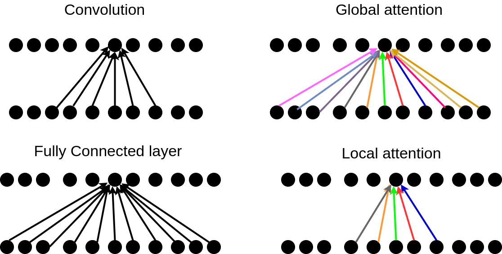

### 1. Scaled Dot-Product Attention  
   - Normal Form of Attention.   
   - $$attn(Q,K,V) = softmax(\frac{QK^T}{\sqrt {d_k}})V$$  
### 2. Global & Local Attention  
   - Global Attention : Attention to ALL TIME-STEPS  
   - Local Attention : Attention to NEARBY TIME-STEPS    
   
   
   
1. 

